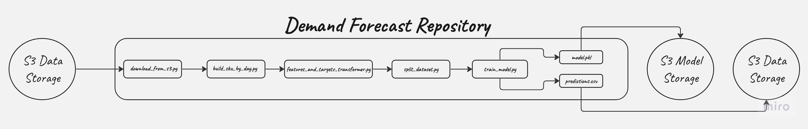

Demand Forecast
==============================
## What is the project about?
Products such as electronics, household appliances have varying characteristics and demand cycles. Category managers, responsible for overseeing these items throughout their lifecycle, face challenges in planning purchases, especially when the assortment spans thousands of items. As data volume increases and platform complexity grows, traditional methods of inventory management and demand forecasting become less effective. In response to these challenges, Supermegaretaillite is investing in the development of an automated system, including an ML-based demand forecasting service.
To preserve the primacy of the source code, the SRC module is loaded in [PyPi](https://pypi.org/project/demand-forecast-source) for further use in repositories [training-pipeline](https://github.com/Edipool/Demand_Forecast_Airflow) and inference-pipeline.

## How use this project?
This project is deployed on the server and is fully ready to work 24/7.
If you want to use this service, you need to:
1. Open [this](http://193.222.62.88:8501) web adress
2. For example, you would like to know the demand for the product with sku id 20 for the next 7 days. You should fill in the fields in web service: SKU_ID = 20, Stock = 10, Horizon Days = 7, Confidence Level = 0.90
3. Сlick the buttons:
3.1 "Get how much to order" to find out how much diawara you need to order from the supplier.
3.2 "Get stock level" to find out how much stock you will have in 7 days.
3.3 "Get low stock sku id" to find out which products will be out of stock in 7 days.

## Pipeline this project

## Main tools used
           

## Project Organization
------------

    ├── app.py      <--- FastAPI app
    ├── configs     <--- Configs for this project
    │   └── train_config.yaml
    ├── data    <--- Data for this project
    │   ├── external        <--- External data
    │   ├── interim     <--- Intermediate data that has been transformed
    │   ├── processed       <--- The final, canonical data sets for modeling
    │   │   ├── features_targets.csv  <--- Features and targets for training
    │   │   ├── predictions.csv     <--- Predictions for test data
    │   │   └── sku_demand_day.csv <--- Data for inference
    │   └── raw                <--- The original, immutable data dump
    │       ├── demand_orders.csv  <--- Raw about orders
    │       ├── demand_orders_status.csv <--- Raw about orders status
    │       ├── features.csv
    │       └── sales.csv
    ├── data.dvc              <--- DVC file
    ├── docker-compose.yml  <--- Docker-compose file
    ├── Dockerfile          <--- Dockerfile for this project
    ├── docs    <--- Documentation for this project
    │   └── ML_System_Design.md  <--- ML System Design Document
    ├── dvc.lock
    ├── dvc.yaml
    ├── LICENSE
    ├── logs        <--- Logs for this project
    │   └── app.log
    ├── Makefile
    ├── MANIFEST.in
    ├── models            <--- Models for this project
    │   ├── losses.json  <--- Losses for models
    │   └── model.pkl  <--- Model for inference
    ├── project_structure.txt  <--- This file
    ├── prometheus_data
    │   ├── app_metrics.py
    │   └── prometheus.yml
    ├── README.md
    ├── requirements.txt
    ├── setup.cfg
    ├── setup.py        <--- Setup file for library based on src folder
    ├── src <--- Source code for use in this project
    │   ├── demand_forecast_source  <--- Library for this project
    │   │   ├── data  <--- Source code for data preprocessing
    │   │   │   ├── __init__.py
    │   │   │   └── split_dataset.py  <--- Split dataset
    │   │   ├── download
    │   │   │   ├── download_from_s3.py  <--- Download data from s3
    │   │   │   └── __init__.py
    │   │   ├── entities <--- Entities for this project
    │   │   │   ├── feature_params.py  <--- Params for features
    │   │   │   ├── model_params.py  <--- Params for model
    │   │   │   ├── split_params.py  <--- Params for split
    │   │   │   ├── train_pipeline_params.py  <--- Params for train pipeline
    │   │   │   └── validation_params.py  <--- Params for validation for FastAPI
    │   │   ├── features  <--- Source code for build features for this project
    │   │   │   ├── AddFeatures.py
    │   │   │   ├── AddTargets.py
    │   │   │   ├── build_sku_by_day.py  <--- Build features for sku by day
    │   │   │   ├── build_transformer.py  <--- Build transformer for features
    │   │   │   └── __init__.py
    │   │   ├── inference
    │   │   │   ├── __init__.py
    │   │   │   └── make_request.py   <--- Make request to FastAPI
    │   │   ├── __init__.py
    │   │   ├── models  <--- Source code for models for this project
    │   │   │   ├── __init__.py
    │   │   │   ├── repro_experiments.py  <--- Train model with MLFlow and experiment fixation
    │   │   │   └── train_model.py  <--- Train model without MLFlow
    │   │   └── visualization
    │   │       ├── __init__.py
    │   │       └── visualize.py
    │   └── __init__.py
    ├── tests  <--- Tests for this project
    │   ├── app
    │   │   └── test_streamlit_app.py  <--- Tests for streamlit app
    │   ├── conftest.py  <--- Configs for tests
    │   ├── data  <--- Tests for data module
    │   │   └── test_data.py
    │   └── models  <--- Tests for models module
    ├── tox.ini
    ├── train_pipeline.py  <--- Run train pipeline
    └── web_app  <--- Streamlit app
        ├── Dockerfile  <--- Dockerfile for streamlit app
        ├── __init__.py
        ├── requirements.txt
        └── streamlit_app.py  <--- Source code for streamlit app

--------
